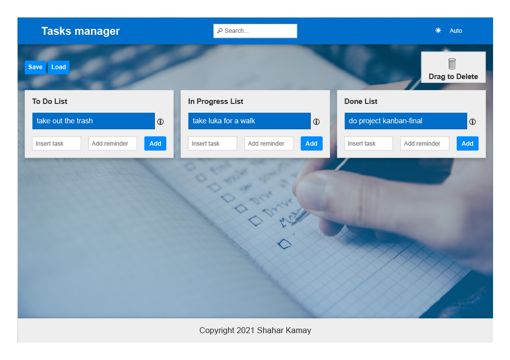
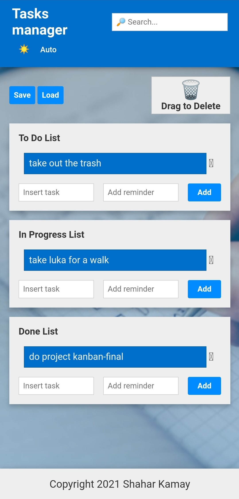

# Kanban-Final ! 

 

# Introduction

This is a task manager interface.

This web-app allows you to handle your tasks in a better way!

## Usage

You can watch the [demonstration guide](https://drive.google.com/file/d/1eG4pY_OOFxek9gBRmln7UdgTnCsjwej-/view).

Simply visit [this page](https://shaharkamay.github.io/kanban-final/solution/), and get CATCHING!

### Usage: Features

* Adding tasks to each list.
* Editing tasks.
* Move tasks between lists (using `alt + 1-3`).
* Search tasks (live-results).
* Save and load data to/from the API.
* Dark/Light/Auto Mode.
* Drag-and-drop sorting of tasks.
* Delete task by dragging it to the trash-can.
* Get information about tasks (`Task`, `Date`, `Reminder`).
* Set a reminder for a task which present an alert when the time and date reached the reminder time and date.
* Is responsive.

## Contributing
Pull requests are welcome. For major changes, please open an issue first to discuss what you would like to change.

## Current Contributors and credits
Shahar Kamay

## License
Cyber4s, 2021